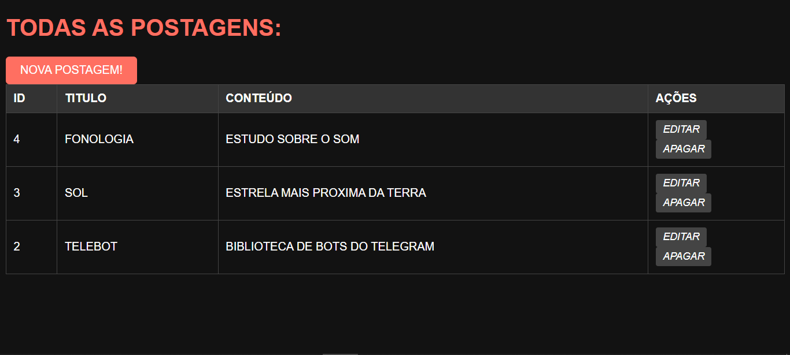
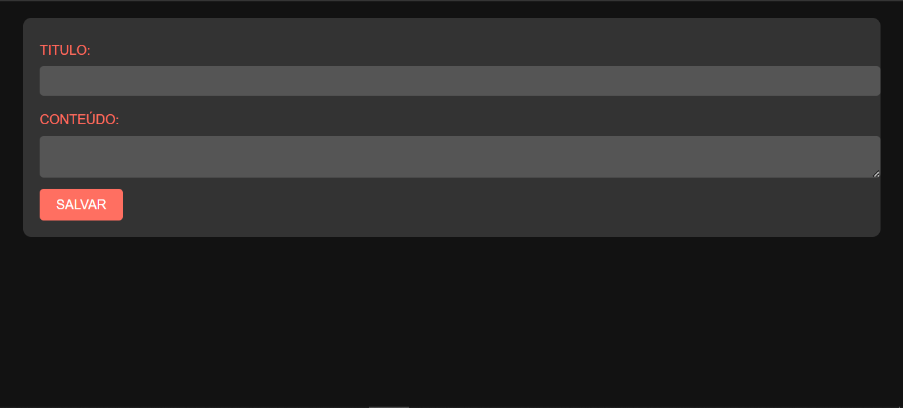
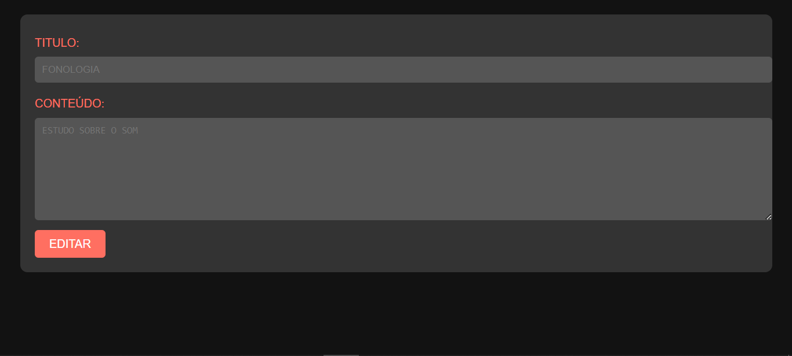

# CRUD DE POSTAGENS COM NODEJS E SQL SERVER
👨‍🏫ESTE APLICATIVO É UMA PLATAFORMA PARA CRIAR, VISUALIZAR, EDITAR E EXCLUIR POSTAGENS.

 <br> 
 <br> 
 <br> 

## DESCRIÇÃO:
Este aplicativo é uma plataforma para criar, visualizar, editar e excluir (CRUD) postagens. Aqui está uma descrição mais detalhada das funcionalidades:

1. **Criação de Novas Postagens**: Os usuários podem criar novas postagens preenchendo um formulário com um título e conteúdo e enviando-o. Isso é feito através do formulário "Nova Postagem!" na página principal.

2. **Visualização de Todas as Postagens**: Todas as postagens existentes são exibidas em uma tabela na página principal. Cada postagem é exibida com seu ID, título e conteúdo.

3. **Edição de Postagens**: Os usuários podem editar uma postagem existente clicando no botão de edição associado a cada postagem na tabela. Isso os levará a uma página de edição onde podem modificar o título e o conteúdo da postagem.

4. **Exclusão de Postagens**: Os usuários podem excluir uma postagem existente clicando no botão de exclusão associado a cada postagem na tabela. Isso removerá permanentemente a postagem do banco de dados.

5. **Layout Responsivo e Estilizado**: Estilo escuro e bonito foi adicionado ao código HTML, utilizando uma paleta de cores predominantemente escura, com elementos em destaque em tons de vermelho (#ff6f61). As formas dos elementos foram suavizadas com bordas arredondadas, e os botões apresentam uma aparência de destaque quando são hoverados. O formulário e a tabela foram estilizados para ter uma aparência limpa e moderna, com contraste adequado para facilitar a leitura.

## EXECUTANDO O PROJETO:
1. **Configuração do Banco de Dados:**
   - Antes de executar o site, é necessário importar o arquivo `DATABASE.sql`. 

2. **Configuração do JS:**
   - Abra o arquivo `./CODIGO/models/db.js` e ajuste as configurações do seu banco de dados nos parâmetros de `sequelize`:

     ```javascript
      const sequelize = new Sequelize('postapp', null, null, {
      dialect: 'mssql',
      dialectModule: require('msnodesqlv8'),
      dialectOptions: {
         options: {
            driver: 'SQL Server Native Client 11.0',
            trustedConnection: true
         }
      },
      host: 'localhost',
      logging: false 
      });
     ```

3. **Instalando as Depêndencias:**
   - Para instalar as dependências listadas no arquivo "package.json", você pode usar o comando `npm install` no terminal. Certifique-se de estar no diretório do seu projeto onde o arquivo "package.json" está localizado. O npm irá ler o arquivo "package.json" e instalar todas as dependências listadas nele. 

```bash
npm install
```

4. **Executando o Aplicativo:**
- Para subir o servidor, no diretório do seu [projeto](./CODIGO/APP.js), digite o seguinte comando no Terminal/CMD:

- Para usar o `NODE`, inicie com o seguinte comando:
 ```bash
 npm start
 ```

- Para usar o `NODEMON`, inicie com o seguinte comando:
 ```bash
 npm test
 ```

- Acesse o APP no navegador visitando [http://localhost:8081](http://localhost:8081).

## NÃO SABE?
- Entendemos que para manipular arquivos em `HTML`, `CSS` e outras linguagens relacionadas, é necessário possuir conhecimento nessas áreas. Para auxiliar nesse aprendizado, oferecemos cursos gratuitos disponíveis:
* [CURSO DE HTML E CSS](https://github.com/VILHALVA/CURSO-DE-HTML-E-CSS)
* [CURSO DE NODEJS](https://github.com/VILHALVA/CURSO-DE-NODEJS)
* [CURSO DE SQL SERVER](https://github.com/VILHALVA/CURSO-DE-SQL-SERVER)
* [CURSO DE EXPRESSJS](https://github.com/VILHALVA/CURSO-DE-EXPRESSJS)
* [CURSO DE HANDLEBARS](https://github.com/VILHALVA/CURSO-DE-HANDLEBARS)
* [CONFIRA MAIS CURSOS](https://github.com/VILHALVA?tab=repositories&q=+topic:CURSO)

## CREDITOS:
- [PROJETO CRIADO BASEADO NO "CRUD DE POSTAGENS COM NODEJS E MYSQL"](https://github.com/VILHALVA/CRUD-DE-POSTAGENS-COM-NODEJS-E-MYSQL)
- [PROJETO FEITO PELO VILHALVA](https://github.com/VILHALVA)


